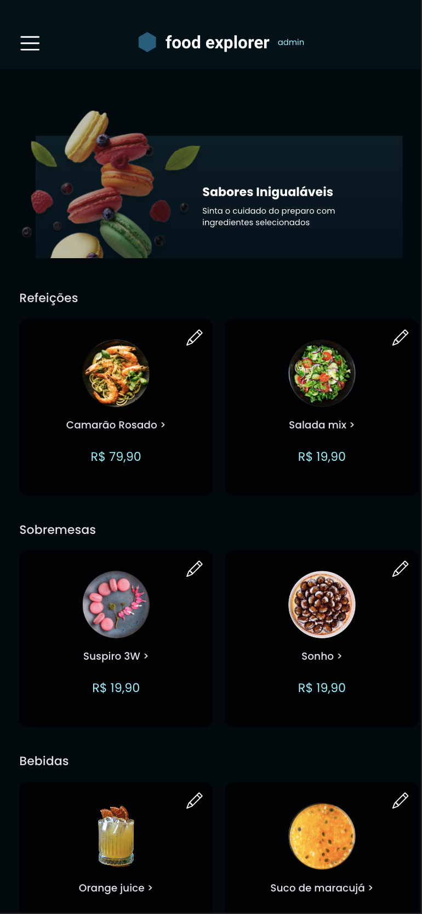
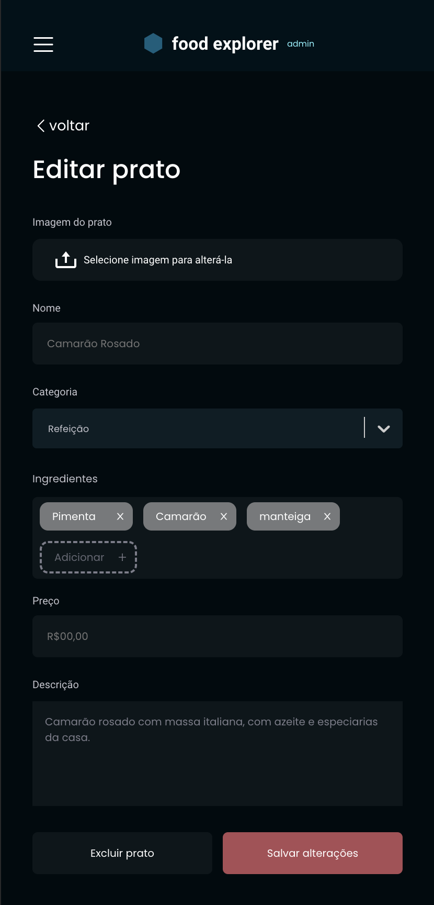
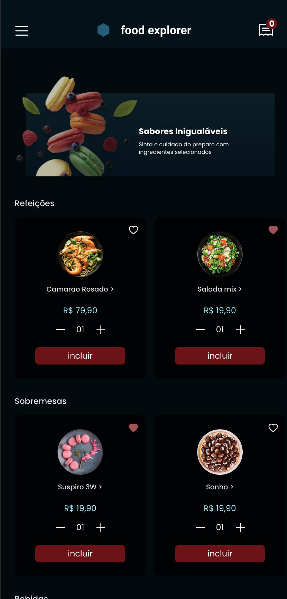
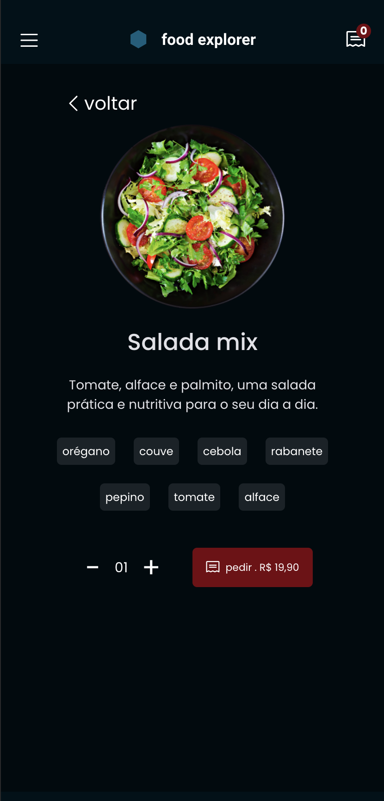

# Food Explorer (frontend), version 1.0 

- Application link (deploy): ********************* 888888888 uuuuuuuuu iiiiiii

- A project for a fictional restaurant called Food Explorer, a challenge from a Rocketseat's Explorer course.

## About this project
- The first page of the application is for authentication. 
When logging in, if you are a regular user, you will have access to the restaurant's available dishes, as well as access to other features related to the dishes, such as dish details and number of items, adding to the value of the product. You will have the option of searching for dishes by their name or by their ingredients, using a search input.
Now, if you are an administrator, the options to edit, update, add and delete a specific dish will be available.

## Main technologies used
React, Styled-components, Vite, React-router-dom, React-icons and Axios.

## Some pages..

  
    
